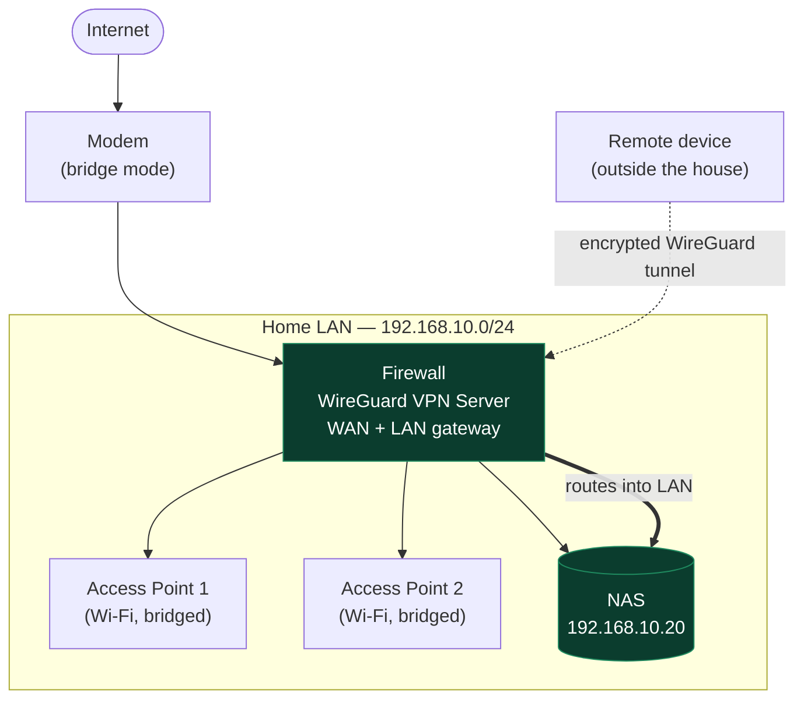

[README (1).md](https://github.com/user-attachments/files/30488496/README.1.md)
# Secure Remote Access to a Home NAS via WireGuard

A home network designed so that private services (a NAS) are **never exposed to the
internet**. Remote access is granted only through an authenticated WireGuard tunnel
that terminates on the perimeter firewall, after which the NAS is reachable on its
private LAN address — exactly as if the client were sitting at home.

> **Design goal:** zero internet-facing attack surface on the NAS. The only service
> listening on the WAN is the WireGuard VPN. An attacker cannot probe, scan, or attempt
> to log into the NAS without first authenticating to the tunnel.

---

## Topology



---

## How it works

1. The modem runs in bridge mode and hands the public connection to the firewall.
2. The firewall is the only device exposed to the WAN. It runs a WireGuard server
   listening on a single UDP port.
3. Two access points connect to the firewall and **bridge** wireless clients onto the
   same LAN subnet — they perform no routing or NAT of their own, so the network has a
   single flat L3 segment behind the firewall.
4. The NAS sits on that LAN. **No port forwarding points at the NAS** — it has no route
   from the internet.
5. When away from home, the remote device brings up the WireGuard tunnel to the
   firewall. The firewall routes that traffic into the LAN, so the browser reaches the
   NAS at its private IP (`https://192.168.10.20`) as though on the local network.

---

## Threat model & design rationale

| Concern | Naïve approach | This design |
|---|---|---|
| Exposing the NAS web UI | Port-forward 443 → NAS | **No forward.** NAS unreachable from WAN |
| Internet scans / brute force | NAS login page is internet-facing | Only the WireGuard port answers; NAS is invisible |
| Credential theft on NAS | Single factor at the app | Must hold a valid WireGuard key *and* NAS creds |
| Lateral movement if app is breached | Attacker already inside | Attacker never reaches the LAN unauthenticated |

The core principle is **defense in depth**: authenticate at the network perimeter
(WireGuard) *before* the application is even reachable, rather than relying on the NAS's
own login as the first line of defense.

---

## Security controls

- Perimeter firewall as the single WAN-facing device; default-deny inbound.
- WireGuard required for all remote access — no service ports forwarded to LAN hosts.
- Access points operate in bridge mode only; no additional routing/NAT layers to misconfigure.
- NAS bound to its private address only; no public DNS record.

---

## Sanitized configuration

**WireGuard server (keys redacted):**

```ini
[Interface]
Address    = 10.20.0.1/24        # VPN tunnel subnet
ListenPort = 51820
PrivateKey = <REDACTED>

[Peer]                            # remote laptop
PublicKey  = <REDACTED>
AllowedIPs = 10.20.0.2/32
```

**Firewall policy (vendor-neutral summary):**

| # | Source | Destination | Port | Action |
|---|---|---|---|---|
| 1 | WAN (any) | Firewall | UDP 51820 (WireGuard) | Allow |
| 2 | WAN (any) | NAS | any | **Deny** |
| 3 | WireGuard clients | NAS | 443 | Allow |
| 4 | any | any | any | Deny (default) |

> ⚠️ Never commit real keys, your public IP, or client VPN profiles. The private
> RFC1918 addresses shown here (`192.168.x`, `10.x`) are safe to publish. The subnet
> and NAS address above are illustrative — substitute your own if you prefer.

---

## Skills demonstrated

Network perimeter design · firewall policy (default-deny) · WireGuard VPN deployment ·
NAT · private addressing & RFC1918 · access-point bridging vs. routing ·
defense-in-depth threat modeling · infrastructure documentation.
